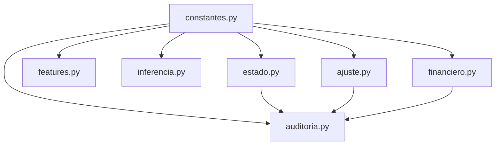

# continuitis/ — Motor CONTINUITY v4.6 Modularizado

> Paquete Python que encapsula las 10 capas del sistema de predicción adaptativa CONTINUITY. 
> Ha sido descompuesto desde un monolito en múltiples módulos con responsabilidades claras, dependencias explícitas y alta cohesión.

---

## Tabla de Contenidos

1. [Visión General de la Arquitectura](#visión-general-de-la-arquitectura)
2. [Módulos: Función y Objetivo](#módulos-función-y-objetivo)
3. [Grafo de Dependencias](#grafo-de-dependencias)
4. [Guía de Uso](#guía-de-uso)
5. [Convenciones de Desarrollo](#convenciones-de-desarrollo)

---

## Visión General de la Arquitectura

El ecosistema está construido sobre un modelo de **10 capas lógicas**, implementadas a través de **7 módulos de negocio**:

*   **Capas 1, 2a, 2b (Estado):** Memoria e inercia matemática del sistema.
*   **Capas 3, 4 (Datos):** Caché, extracción, ingeniería de características (Feature Engineering).
*   **Capa 5 (Inteligencia):** Inferencia mediante Machine Learning (Random Forest / GBM).
*   **Capas 6, 6b, 7 (Ajuste):** Calibración estocástica, factores exógenos y Dixon-Coles.
*   **Capa 8 (Gestión de Riesgo):** Escudo Financiero y evaluación matemática de cuotas.
*   **Capas 9, 9b, 10 (Auditoría):** Retroalimentación de la IA, control de ROI y Backtesting.

---

## Módulos: Función y Objetivo

A continuación se detalla exhaustivamente la razón de ser de cada archivo y carpeta dentro del paquete `continuitis/`.

### 1. `__init__.py` — (Punto de Entrada)
*   **Función:** Re-exportar de forma centralizada todos los símbolos públicos (clases, constantes y métodos) de los módulos subyacentes.

*   **Objetivo:** Actuar como un patrón *Facade* (Fachada). Permite que sistemas externos (como la CLI de `CONTINUITY.py` u otras pantallas de UI) puedan importar cualquier componente desde `continuitis` como si fuera un solo archivo, manteniendo total compatibilidad hacia atrás.

### 2. `constantes.py` — (Configuración Global)
*   **Función:** Almacenar de manera estática toda la parametrización del sistema. Contiene hiperparámetros de los modelos, thresholds (umbrales) de riesgo (`EV_THRESHOLD`, `KELLY_FRACTION`), definiciones de características (`FEATURE_COLUMNS`), configuraciones de entorno y funciones puras (*helpers*).

*   **Objetivo:** Ser la "hoja" del árbol de dependencias. Al no importar nada de los otros módulos de `continuitis`, asegura que cualquier módulo pueda leer la configuración del negocio sin causar dependencias circulares. Permite "tweakear" y calibrar el sistema desde un solo lugar.


### 3. `estado.py` — (Capas 1, 2a, 2b - Persistencia SQLite)
*   **Función:** Gestionar la lectura y escritura de los estados dinámicos del modelo hacia la base de datos relacional SQLite (`cerebrillum.db`). Define las clases `EstadoAdaptativo`, `MotorOnline` (EWMA adaptativo) y `BlendAdaptativo`.

*   **Objetivo:** Dotar de memoria a largo plazo a la inteligencia artificial mediante persistencia ACID sin depender de archivos JSON frágiles. Mantiene la inercia matemática y el estado de forma reciente de cada equipo.

### 4. `motor_deportivo.py` — (Fábrica y Motores Multideporte)
*   **Función:** Proporcionar la abstracción `BaseDeporteEngine` e implementar los motores específicos para cada disciplina deportiva: `FutbolEngine` (Poisson + Dixon-Coles), `BaloncestoEngine` (Distribución Normal Skewed), `TenisEngine` (Cadenas de Markov) y `BeisbolEngine` (Distribución de Skellam).

*   **Objetivo:** Permitir que CONTINUITY opere como un fondo cuantitativo verdaderamente diversificado multideporte. Ofrece una fábrica `obtener_motor_deportivo(deporte)` para cambiar de modelo matemático en tiempo real según la disciplina analizada.

### 4. `features.py` — (Capas 3, 4)
*   **Función:** Orquestar la obtención de datos puros desde la base de datos SQL (`DataPipeline`) y transformarlos en tensores/vectores estadísticos aptos para algoritmos de Machine Learning. Además, implementa un robusto sistema de caché en disco (Archivos Parquet) y en memoria (`FeatureStore`).

*   **Objetivo:** Actuar como la "refinería de datos". Su meta es proveer ventanas de rendimiento estadístico, métricas de desgaste y métricas históricas de forma óptima. A través de las memorias caché, evita el colapso de la base de datos y acelera exponencialmente las iteraciones durante las fases de simulación y entrenamiento.

### 5. `inferencia.py` — (Capa 5)
*   **Función:** Encapsular la lógica de modelado predictivo, específicamente el `MotorInferenciaIA`. Maneja el entrenamiento multi-núcleo (multiprocessing) de los modelos Random Forest y Gradient Boosting, así como su inferencia, y la serialización (guardado/carga) de los modelos en disco (`.pkl`).

*   **Objetivo:** Ser el núcleo predictivo primario ("El Cerebro"). Su único fin es encontrar patrones complejos, correlaciones no lineales y tendencias a partir de las *features* generadas, para predecir las probabilidades base de rendimiento de los equipos antes de que los ajustadores externos las modifiquen.

### 6. `ajuste.py` — (Capas 6, 6b, 7)
*   **Función:** Contiene el `AjustadorCuantico` y el `TransmutadorEstocastico`. Se encarga de tomar las predicciones crudas del modelo de IA y aplicarles penalizaciones o bonificaciones matemáticas basadas en factores exógenos del mundo real (clima, fatiga acumulada, necesidad por posición en la tabla, métricas avanzadas xG). Utiliza la distribución bivariada de Dixon-Coles (calculando el $\rho$ endógeno) para mapear fuerzas a probabilidades concretas.

*   **Objetivo:** Aterrizar el modelo estadístico a la realidad futbolística y estocástica. Un algoritmo ML puro desconoce la "dinámica" humana (ej. un equipo que ya es campeón no juega con la misma fuerza); este módulo inyecta ese contexto e interrelaciona (Dixon-Coles) la fuerza ofensiva y defensiva de ambos equipos simultáneamente para calcular las verdaderas probabilidades del mercado (1X2, Over/Under).

### 7. `financiero.py` — (Capa 8)
*   **Función:** Definir la clase `EscudoFinanciero`. Implementa métodos como `evaluar_triple` y `evaluar_binario`, los cuales normalizan las cuotas (limpiando el *overround* o comisión de la casa), calculan el Valor Esperado (EV), el *edge* competitivo, aplican la penalización de la racha perdedora y, finalmente, definen el *stake* (monto a apostar) usando el criterio de Kelly fraccionado.

*   **Objetivo:** Es la barrera de protección patrimonial y el tomador de decisiones finales. Su objetivo fundamental es asegurar que el sistema sea rentable a largo plazo, denegando apuestas (incluso cuando el equipo sea claro favorito) si el precio (cuota) ofrecido no tiene el valor matemático necesario para superar la ventaja de la casa.

### 8. `auditoria.py` — (Capas 9, 9b, 10)
*   **Función:** Evaluar post-partido el desempeño de las predicciones (`RegistradorFeedback`), calcular y guardar los reportes de rendimiento financiero real en ROI (`AuditorRentabilidad`), y orquestar las simulaciones masivas con datos del pasado (`Backtester`).

*   **Objetivo:** Cerrar el lazo (Feedback Loop). Su responsabilidad es comparar la "fantasía matemática" de las predicciones con el resultado empírico real. Esta retroalimentación modifica el estado adaptativo (inercia) y la distribución del portafolio, garantizando la mejora continua del ecosistema (evolución darwiniana del modelo).

### Carpetas Internas Relacionadas
*   `__pycache__/`: Caché de Python (Bytecode `.pyc`) gestionado automáticamente por el intérprete para tiempos de carga rápidos.

---

## Grafo de Dependencias

Para asegurar un diseño limpio y mantener el sistema libre de vulnerabilidades de "importación circular", el paquete obedece a un grafo **DAG** (Directed Acyclic Graph):


*   **Regla de Oro:** Un módulo **nunca** debe importar símbolos de un módulo que dependa de él.
*   **Cero dependencias de negocio en Financiero:** Notar que `financiero.py` solo depende de `constantes`. Esto permite reutilizar el módulo financiero en cualquier otra rama del sistema sin tener que inicializar modelos de Machine Learning.

---

## Guía de Uso

El desacople permite distintas maneras de consumo según el contexto.

### 1. Consumo Completo (Compatible con el monolito original)
Carga todo en memoria, ideal para los scripts principales (`CONTINUITY.py`).
```python
from continuitis import DataPipeline, MotorInferenciaIA, EscudoFinanciero
```

### 2. Consumo Aislado Específico (Micro-ejecuciones rápidas)
Para scripts UI, Dashboards o Lambdas, importa sólo la lógica financiera o de estado sin arrancar pesadas librerías de Machine Learning:
```python
from continuitis.financiero import EscudoFinanciero
from continuitis.ajuste import TransmutadorEstocastico
```

---

## Convenciones de Desarrollo

1.  **Nuevas Constantes:** Todo umbral, nombre de archivo o parámetro numérico global **debe** vivir en `constantes.py`.
2.  **No romper el DAG:** Si el módulo `features.py` necesita un método matemático financiero, ese método debe aislarse en un `utils` puro o en `constantes`, o la lógica debe repensarse. `features.py` nunca debe importar a `financiero.py`.
3.  **Encapsulamiento del Estado:** Los archivos en disco generados por un módulo (`modelos_rf`, `state.json`) son propiedad exclusiva de la clase que los generó. Ningún otro módulo debe leer o modificar esos archivos directamente saltándose los métodos de la clase propietaria.